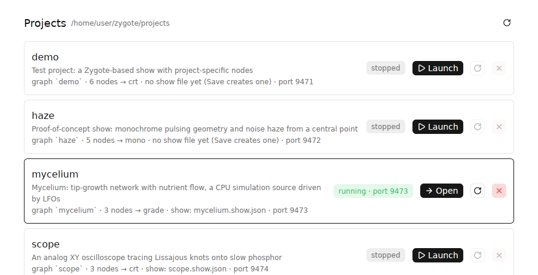
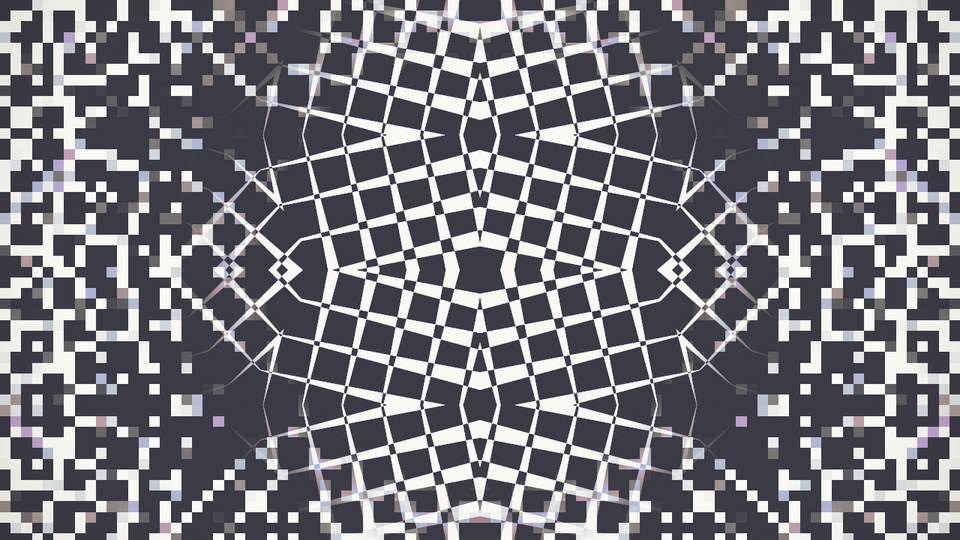
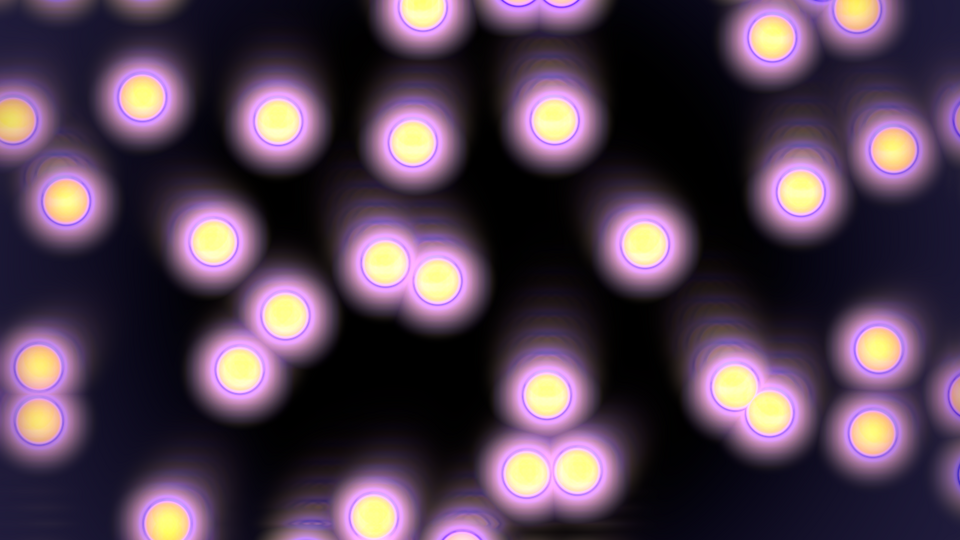
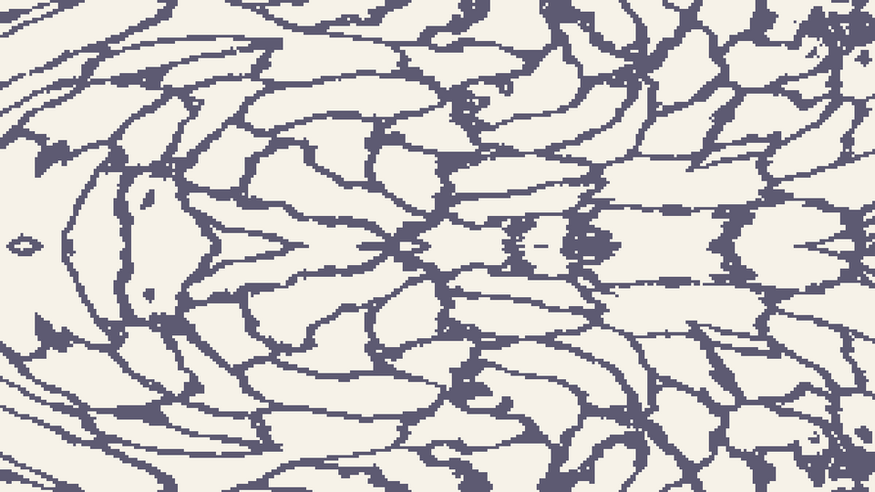

# Zygote

A real-time visual signal chain for live shows. A show is a graph of GPU
passes (nodes) driven by a cue timeline, with LFOs and envelopes layered on
top and keys to fire them. The engine is a library; each show is a small
Rust project that depends on it and adds its own nodes in WGSL or Rust.

```
┌──────────────────────────────┐   UDP / JSON, numbers and ids only   ┌─────────────────────────────┐
│  zygote-timeline             │ ────────────────────────────────────▶ │  the project's binary       │
│  project browser, cues,      │ ◀─ ─ ─ ─ ─ ─ ─ ─ ─ ─ ─ ─ ─ ─ ─ ─ ─ ─ │  = zygote-render library    │
│  transport, modulation rack  │   structure + typed params on connect│  + its nodes + its graph    │
└──────────────────────────────┘                                       └─────────────────────────────┘
               └──────── zygote-core: node defs, typed params, graphs, cues, modulation, protocol ────┘
```

The UI never sees a texture or a shader; the renderer never sees a widget.
Both share the graphics-free core, so they agree on what a parameter is,
how cues interpolate and what an LFO reads at a given transport time.

## Quick start

```sh
cargo run --release -p zygote-timeline
```



That opens the **project browser**: every crate under `projects/`, read
straight from the workspace, with its description, graph, show file and the
UDP port it will use. **Launch** builds the renderer if the binary is
missing, starts it, waits until it answers on its port, opens the timeline
with the project's show file and tiles the output window beside it. Cards
show stopped / building / starting / running / failed (with the reason and
the log under `target/zygote/`), and have **Restart** and **Stop**. The
panel button at the top left of the timeline returns to the list while the
renderer keeps running; closing the window stops every renderer it started,
and a renderer whose launcher dies exits on its own. Several projects can
run at once on their own ports.

Then noodle: move sliders, add cues with `⏎`, press play, bind a key to an
envelope, **Save**. The show file lands next to the project.

## What is in the box

| crate | what |
| --- | --- |
| `crates/zygote-core` | Graphics-free data model: node definitions, typed parameters, graphs, cue timeline, modulation, wire protocol. Pure functions, unit tested. |
| `crates/zygote-macros` | `#[derive(NodeParams)]`: a Rust struct is a node's whole parameter declaration. |
| `crates/zygote-render` | The engine as a library (nannou 0.20 / Bevy 0.19) plus the stock `zygote` binary. One generic shader-node material; node code never touches Bevy. |
| `crates/zygote-timeline` | The gpui-kit window: project browser and renderer supervisor, graph view, transport, cue axis, typed controls, modulation rack. |

| project | what |
| --- | --- |
| `projects/demo` | The reference project: one Rust-declared node (`rgb_shift`), one WGSL-file node (`scanlines`), an image source, its own graph and assets. |
| `projects/haze` | Monochrome pulsing geometry and 3D-noise haze from a central point. Three WGSL nodes. |
| `projects/mycelium` | A CPU simulation source (tip-growth network traced by nutrient agents) with LFOs and an envelope on its parameters. |
| `projects/scope` | An analog XY oscilloscope: the beam traces Lissajous knots onto slow phosphor; cues step through harmonic ratios, an LFO turns the figure, keys flash and wipe it. Three WGSL nodes. |
| `projects/lattice` | Op-art from builtins only: a beating `checker` moiré through `kaleido` and `mirror_tile`, sharp in the center and `pixelate`d at the edges via a `radial_gradient` mask into `luma_mask`. Keys chunk the pixels and kick the spin. |
| `projects/orbs` | Bloom study: `voronoi` bubbles colored by a palette, smeared upward by `streak`, thresholded `blur` added back with `blend`. LFOs breathe the cells and pulse the glow. |
| `projects/etching` | Ink on paper: cell edges warped by noise through `warp`'s displacement input, traced by `edge_detect`, mirrored, `dither`ed to two levels and printed as two `solid` colors through `luma_mask`. |

| `projects/haze` | `projects/mycelium` | `projects/scope` |
| --- | --- | --- |
|  |  |  |

| `projects/lattice` | `projects/orbs` | `projects/etching` |
| --- | --- | --- |
|  |  |  |

| the timeline | `projects/scope` through its cues |
| --- | --- |
|  |  |

Everything can also be started by hand, which is what the browser does for you:

```sh
cargo run --release -p zygote-scope                                   # a renderer on udp://127.0.0.1:9471
cargo run --release -p zygote-timeline -- projects/scope/scope.show.json   # the UI, straight into that show
cargo run --release -p zygote -- --showcase                            # stock renderer, builtin nodes only
cargo run --release -p zygote -- examples/graphs/palette.json         # stock renderer, any graph file
```

Renderer options: `[graph.json] [--port N] [--size WxH] [--assets DIR]
[--nodes DIR] [--showcase] [--free-run] [--exit-with-parent]
[--capture out.png [--frames N] [--every K]]`. UI options:
`[show.json] [--target host:port]`; with neither it opens the browser.

## The UI

**Graph and parameters.** The UI asks the renderer for its graph structure
and parameter list, draws the graph, and builds one control per parameter:
sliders for floats and ints, per-component sliders for vec2 and color
(r, g, b, a), a switch for bools, a button row for choices. Click a node in
the graph to focus its parameters, click empty canvas to show all. Image
sources show their file as a thumbnail on the graph and a preview in the
list; only the path crosses the wire. Double-click a row to reset it to its
default. Hover any button for what it does and its key; the `ⓘ` button in
the header lists every key and gesture.

**Transport owns time.** While the UI is connected the renderer's clock
follows the playhead: pause freezes the picture, stop returns to the last
cue, scrubbing scrubs the animation, feedback trails freeze too. A renderer
with no UI attached free-runs on the wall clock (`--free-run` forces that).

**Cues.** Stopped and parked on a cue, every control edits that cue
directly; the mode chip says `editing cue N`. While playing, or after
`Force live`, controls are live values layered over the cues until
released. `⏎` adds a cue at the playhead that absorbs the current live
values; `[` and `]` park on the previous and next cue. The lane under the
chips shows how values travel between cues: a ramp interpolates, a flat
line then a jump cuts (`Into cue: step / ramp`).

**Modulation.** Sources live in the left rail: LFOs (sine, triangle, saw,
square; rate, phase) and ADSR envelopes fired by a named trigger. Each float
or int row has a `mod` chip: pick a source and a bipolar depth, and the
source's value times depth is *added* to the resolved value, so the slider
always means the center and depth 0 is exactly the slider. A dark ghost
mark on the slider shows where the value actually is. Sources run on the
transport clock, so pausing freezes them and scrubbing rewinds them, and
both processes evaluate the same definition. Envelopes are a pure function
of the gate log.

**Keys.** Transport keys are handled at the window and no control can
swallow them: `space` play/pause, `esc` stop, `home` start, `[` `]` cues,
`⏎` add cue, `l` loop, `e` edit/live, `t` tile the output window beside the
UI, `shift-t` pop it out. Everything else is learned: press `Learn` on an
envelope or on a cue, then a key. Holding the key gates the envelope;
pressing it parks on the cue. Transport keys are refused. Bindings are
saved in the show file.

**Output window.** The output is a quad in a perspective 3D scene: wheel
dollies, left-drag pans, right-drag (or middle-drag) orbits, arrows pan,
`+`/`-` dolly, `Home` or `0` resets to the flat full-frame view, `S` saves a
screenshot, `Esc` quits. The window is re-created if the OS removes it
(monitor unplugged); the close button quits.

## Writing nodes

A node is one fullscreen pass with named texture inputs, an optional
feedback tap and typed parameters. That is the whole vocabulary; render
targets, cameras, wiring, feedback ping-pong, uniform layout, UI controls
and cue interpolation are all derived from the declaration.

**A WGSL file** with a `//!` header, loaded from a project's `assets/nodes/`
and hot-reloaded on save:

```wgsl
//! node: scanlines
//! doc: CRT-style scanlines
//! input source
//! param density: float = 180 in 20..600 "Lines across the frame"
//! param tint: color = #b8ffd0 "Phosphor tint"

@fragment
fn fragment(in: VertexOutput) -> @location(0) vec4<f32> {
    let src = source(in.uv);                          // inputs are functions
    let line = 0.5 + 0.5 * sin(in.uv.y * params.density * 3.14159);
    return vec4<f32>(src.rgb * line * params.tint.rgb, src.a);   // params.<name>, frame.time, frame.aspect
}
```

**A Rust type**, when you want typed access or to ship the node in a crate.
The same declaration with a `RustSource` impl instead makes a CPU texture
source: Zygote calls `update(&params, &frame, &mut pixels)` every frame and
uploads the result, which is how `projects/mycelium` runs its simulation.

```rust
use zygote_render::prelude::*;

#[derive(NodeParams, Clone)]
struct RgbShift {
    /// Offset distance (fraction of frame height)
    #[param(default = 0.004, min = 0.0, max = 0.05)]
    amount: f32,
    #[param(default = "radial", options = ["fixed", "radial"])]
    mode: String,
    #[param(default = "#ffffff")]
    tint: [f32; 4],
}

impl RustNode for RgbShift {
    const NAME: &'static str = "rgb_shift";
    const INPUTS: &'static [Input] = &[Input::required("source")];
    const SHADER: &'static str = include_str!("rgb_shift.wgsl");
    type Params = Self;
}

fn main() {
    ZygoteApp::new()
        .asset_root(env!("CARGO_MANIFEST_DIR"))
        .register::<RgbShift>()
        .node_dir("nodes")
        .graph_file("graphs/main.json")
        .parse_args()
        .run();
}
```

**Parameter types:** `float` (min..max), `int` (min..max, stepped), `bool`,
`choice` (named options; a `u32` index in WGSL), `color` (`#rrggbb` or
`#rrggbbaa`, a `vec4<f32>`), `vec2` (`x, y`). Floats, vec2 and colors
interpolate between cues, ints step through whole values, bools and choices
hold until the target cue's time. Colors are RGBA: generators emit their
color's alpha, filters keep their source's alpha, `blend` and `luma_mask`
composite it, trails let it decay. The output quad is opaque, so alpha only
matters inside the graph.

**Generated WGSL** gives every node `params.<name>`, `<input>(uv)`,
`has_<input>()`, `previous(uv)` for feedback nodes, and `frame.{time, dt,
aspect, index}`. Anything per 1/60 s (decay, zoom, rotate) should be scaled
by `frame.dt` so the look does not depend on frame rate, and a zero-length
frame should change nothing, which is what makes pause freeze the picture.
`#import zygote::common::{...}` offers `hash3`, `gnoise3`, `fbm3`,
`rotate2`, `luma`, `hue_rotate`, `palette`, `TAU`. Param and input names
must not collide with imported items; the header parser rejects that.

**Builtin nodes** (`crates/zygote-core/nodes/`), by role:

| role | nodes |
| --- | --- |
| generators | `solid`, `test_pattern`, `noise` (fBm), `voronoi` (cells / edges / distance / bubbles), `checker` (scroll, rotate, moiré), `radial_gradient` (circle / square / diamond) |
| geometry | `warp` (procedural, or a `displacement` input), `kaleido`, `mirror_tile`, `pixelate` |
| compositing | `blend` (multiply / screen / add / alpha), `luma_mask` (b over a through a mask input, or b's own brightness) |
| time | `feedback` (zoom / rotate / hue spiral trails), `streak` (directional trails) |
| analysis and finishing | `edge_detect`, `blur` (one axis or both; threshold for bloom), `dither`, `vignette`, `color_grade` (palette remap keeps the source luminance) |


Bloom is a graph, not a node: `blur` with a threshold, then `blend` in `add`
mode over the source. `examples/graphs/palette.json` chains most of the set.
Structural kinds the renderer implements itself: `image` (PNG/JPEG asset,
missing files render as a magenta checker and log an error) and `camera`
(placeholder; no capture backend yet).

If an effect cannot be expressed as one pass with these declarations, the
answer is to grow this vocabulary in Zygote (a compute pass, an intermediate
target), not to hand a node Bevy's `World`.

## Files

**Graph** (`assets/graphs/main.json`): wiring and base values only; what a
type means comes from the library.

```json
{
  "name": "demo",
  "nodes": [
    { "id": "image",   "type": "image", "path": "images/sample.png" },
    { "id": "warp",    "type": "warp", "inputs": ["image"], "params": { "amount": 0.06 } },
    { "id": "kaleido", "type": "kaleido", "inputs": ["warp"], "params": { "segments": 8, "tint": "#ffe0c0" } },
    { "id": "trails",  "type": "feedback", "inputs": ["kaleido"], "params": { "decay": 0.88 } }
  ],
  "output": "trails"
}
```

**Show** (`<project>.show.json`, owned by the UI): cues, modulation and
learned keys. Values are addressed as `node.param`.

```json
{
  "cues": [
    { "id": 1, "time": 0.0, "label": "ring",  "transition": "cut",         "values": { "beam.ratio_x": 1.0, "beam.ratio_y": 1.0 } },
    { "id": 2, "time": 6.0, "label": "eight", "transition": "interpolate", "values": { "beam.ratio_x": 1.0, "beam.ratio_y": 2.0 } }
  ],
  "duration": 48.0,
  "looping": true,
  "modulation": {
    "sources": [
      { "id": "turn",  "kind": "lfo", "rate_hz": 0.02, "phase": 0.0, "shape": "sine" },
      { "id": "flash", "kind": "envelope", "adsr": { "attack": 0.01, "decay": 0.25, "sustain": 0.3, "release": 0.6 }, "trigger": "flash" }
    ],
    "assignments": [
      { "target": "beam.phase",     "source": "turn",  "depth": 0.5 },
      { "target": "beam.intensity", "source": "flash", "depth": 2.0 }
    ]
  },
  "keys": { "q": { "action": "trigger", "trigger": "flash" } }
}
```

A test checks every project's show file against its graph and node headers,
so a typo in a cue target fails the build.

## Architecture notes

- **Passes.** `nodes::build_runtime` walks the graph in topological order;
  each shader node gets an offscreen `Camera3d` on its own render layer, a
  fullscreen quad with the single `NodeMaterial`, and an `Rgba16Float`
  target (two for feedback, swapped every frame). The pipeline key carries
  the node's generated shader, so one material type renders every node
  kind. The window shows the output on a quad in a perspective 3D scene.
- **Resolution order** (`zygote_core::resolve_params`): graph base value →
  cue → live override → modulation offsets on floats and ints → conform to
  the type. Both processes run the same function.
- **Protocol v2.** JSON per UDP datagram, version field in every renderer
  message: `hello`, `structure` (UI-facing graph summary, including a
  preview file path for image sources), `describe` (typed parameter
  descriptors, chunked), `set_param(s)`, `clear_param`, `clear_all`,
  `transport` (drives the renderer's clock; 3 s without one and it
  free-runs), `arrange` (places the output window), `modulation` (the
  show's sources and assignments), `gate` (trigger on/off at transport
  time), `ping`/`pong`.
- **Timeline crate.** One state store (`app/mod.rs`), logic modules beside
  it (`transport`, `controls`, `modulation`, `net`, `keys`, `output`), one
  file per component under `app/views/`. `shell.rs` hosts either the
  browser or the timeline; `supervisor.rs` owns renderer processes;
  `projects.rs` reads the workspace.
- **Projects** are workspace members depending on `zygote-render` by path.
  Version pinning and a project template are deferred until a project needs
  to stop moving with the engine.

## Building and testing

nannou `0.20.0` is the first Bevy-based nannou and pins Bevy `0.19`; gpui-kit
`0.6.0` builds on `gpui-pre 0.3.x`. Both are pinned with `=`. Bevy 0.19
needs rustc ≥ 1.95; `rust-toolchain.toml` pins channel 1.98. The dev
profile uses `opt-level = 1` and line-table debug info; full debug info made
gigabyte binaries.

Linux build deps (Debian/Ubuntu): `libxkbcommon-dev libxkbcommon-x11-dev
libwayland-dev libasound2-dev libudev-dev libzstd-dev pkg-config`.

```sh
CARGO_TARGET_DIR=target-core cargo test -p zygote-core -p zygote-macros   # the data model, fast
cargo test -p zygote-timeline --bin zygote-timeline                       # project discovery
scripts/smoke.sh                                                          # every project, headless
scripts/smoke.sh haze                                                     # one project
```

The smoke test builds every project, renders frames of each headless (Xvfb
and Mesa lavapipe when there is no display, the real GPU otherwise) and
fails on logged errors or a black frame. Frames land in `target/smoke/`.
CI runs the core tests, clippy and rustfmt, and the smoke test on Linux and
macOS. Run the smoke test before pushing.

## Not yet

- Live camera capture (the `camera` kind and hook exist).
- Audio analysis (`audio_band` and `audio_level` sources and the band
  resource exist; nothing fills them).
- Runtime graph editing from the UI; graphs are files.
- Compute passes and multi-pass nodes; the vocabulary grows when an effect needs them.
- In-UI preview of the output (the output window tiles beside the UI instead).
- Key learn for bools and momentary values; MIDI and audio-onset triggers.
- Cue-able modulation depth and LFO rate.
