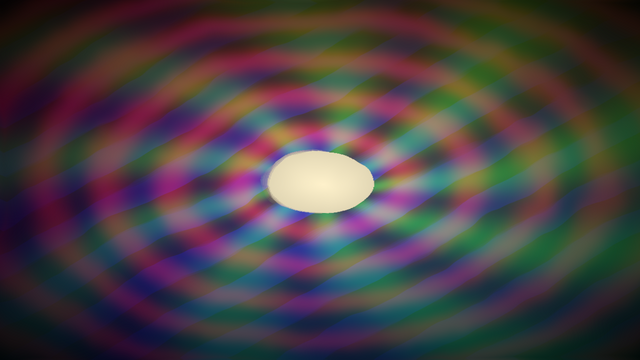
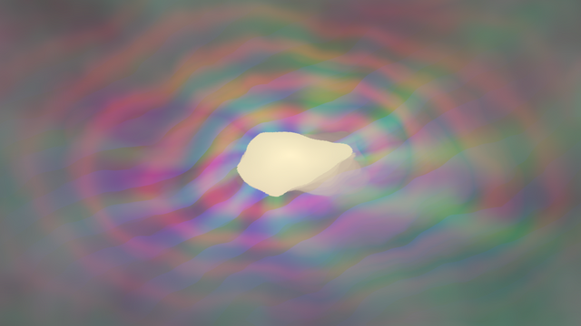

# Zygote

A real-time visual signal chain: image → warp → feedback → window, driven by a
cue timeline. Two processes, one shared data model.

```
┌────────────────────┐   UDP / JSON (node.param = value)   ┌───────────────────────────┐
│  zygote-timeline   │ ───────────────────────────────────▶ │  zygote-render            │
│  gpui-kit host UI  │ ◀─ ─ ─ ─ ─ ─ ─ ─ ─ ─ ─ ─ ─ ─ ─ ─ ─ ─ │  nannou 0.20 / Bevy 0.19  │
│  cues · transport  │      Describe (param list, once)     │  node graph · shaders     │
└────────────────────┘                                      └───────────────────────────┘
            └──────────────── zygote-core (graph, params, timeline, protocol) ───────────────┘
```

| crate | what |
| --- | --- |
| `crates/zygote-core` | Graphics-free data model: node graph, parameter addressing (`node.param`), modulators, cue timeline, wire protocol. Fully unit tested. |
| `crates/zygote-render` | nannou/Bevy app. Instantiates the graph as render-to-texture passes with custom WGSL materials and shows the result on a quad in a perspective 3D scene. |
| `crates/zygote-timeline` | gpui-kit window: transport, cue axis, one slider per parameter. Sends numbers, knows nothing about textures. |

| first pass: image → warp → feedback | showcase graph (every node kind) | timeline UI |
| --- | --- | --- |
|  |  |  |

Screenshots were produced headless (Xvfb + Mesa lavapipe) with the timeline
connected and cue 1 applied.

## Versions

nannou `0.20.0` is the first Bevy-based nannou release and pins Bevy `0.19`.
gpui-kit `0.6.0` builds on the `gpui-pre 0.3.x` snapshot of Zed's gpui. Both
are pinned with `=` in the workspace `Cargo.toml`; nannou's Bevy migration is
still moving (nannou-org/nannou#946), so bump the pair deliberately.
Bevy 0.19 needs rustc ≥ 1.95; `rust-toolchain.toml` pins a compatible stable.

Linux build dependencies (Debian/Ubuntu names): `libxkbcommon-dev
libxkbcommon-x11-dev libwayland-dev libasound2-dev libudev-dev libzstd-dev`.

## Running the first pass

```sh
# terminal 1: image → warp → feedback → window (default graph)
cargo run --release -p zygote-render

# terminal 2: timeline UI; connects to udp://127.0.0.1:9471, starts with two demo cues
cargo run --release -p zygote-timeline
```

The timeline asks the renderer to describe its graph and builds a slider for
every parameter it reports. Press **Play**: the playhead loops over 8 seconds
and interpolates from cue 1 (gentle warp, short trails) to cue 2 (strong warp,
twist, long zooming trails). Click the axis to scrub, drag a marker to move a
cue. Moving a slider takes manual control of that parameter; it stays yours
until you press its release button, and manual values always beat the cues.

Renderer keys: `S` saves a screenshot next to the executable, `Esc` quits.

Other graphs and options:

```sh
cargo run -p zygote-render -- examples/graphs/showcase.json      # every node kind
cargo run -p zygote-render -- --showcase --size 1920x1080         # built-in showcase, larger targets
cargo run -p zygote-render -- --capture out.png --frames 120      # render N frames, save, exit
cargo run -p zygote-timeline -- examples/timelines/two-cues.json  # load/save a specific cue file
```

## Signal-chain primitives

Every node is a `NodeSpec` (`id`, `type`, `inputs`, `params`) in an ordered,
reconfigurable `Graph`. Processing nodes are texture in → texture out.

| type | inputs | parameters | notes |
| --- | --- | --- | --- |
| `image` | – | – | PNG/JPEG from the asset directory |
| `camera` | – | – | Live input. No capture backend yet: renders a placeholder and logs a warning. The output is an ordinary `Image` a backend only has to write into. |
| `solid` | – | `r g b` | |
| `test_pattern` | – | `scale` | Colour bars, grid, ring |
| `noise` | – | `scale speed octaves contrast` | fBm gradient noise, two independent channels so it can drive warps |
| `warp` | `source`, optional `displacement` | `amount scale speed twist` | UV remap by a displacement texture or an internal animated noise field |
| `blend` | `a b` | `mode mix` | multiply / screen / add / alpha (`mode` 0–3) |
| `feedback` | `source` | `decay zoom rotate hue_shift mix` | Ping-pong render targets; last frame is transformed and lightened under the source |
| `color_grade` | `source` | `hue saturation posterize palette palette_mix lut_mix` | Optional `lut` image (horizontal strip indexed by luminance) plus built-in cosine palettes |

Modulators live on the graph as `modulations`: `time`, `lfo` (sine / triangle
/ saw / square), and the audio hook `audio_band { band }` / `audio_level`.
Audio bands are an 8-slot `AudioBands` resource that nothing fills yet; an
FFT stage only needs to write into `AudioBandsRes` each frame.

## Architecture notes

**Addressable parameters.** Every controllable value is `node_id.param`.
`Graph::describe_params()` lists them with ranges; that list is what the
renderer sends to the UI, and what the timeline stores in cues. Nothing
downstream of `zygote-core` hardcodes a pipeline.

**Render passes.** `nodes::build_runtime` walks the graph in topological
order and, per processing node, spawns an offscreen `Camera3d` on its own
render layer, a fullscreen quad with that node's `Material`, and an
`Rgba16Float` render target (`Image::new_target_texture`). Camera `order`
follows graph order so each frame flows source → output. The feedback node
owns two targets and swaps them every frame (`swap_feedback`); `rewire`
repoints downstream materials at whichever texture is current. The window
camera is a perspective `Camera3d` at z = 3 looking at a quad textured with
the output.

**Shaders.** One WGSL file per node kind under
`crates/zygote-render/src/shaders/`, embedded with `embedded_asset!` and
sharing `zygote::common` (noise, hue rotation, palettes). Parameters are
packed into `vec4` lanes. Build with `--features hot_reload` to have Bevy
watch the embedded shaders.

**Resolution order** (`zygote_core::resolve_params`): graph base value →
timeline cue → manual override → plus modulators, clamped to the spec range.
The UI evaluates the timeline itself and only ever sends resolved numbers, so
the renderer treats cue values and manual overrides identically.

**Protocol.** JSON per UDP datagram (`zygote_core::Message`): `hello`,
`describe`, `set_param`, `set_params`, `clear_param`, `clear_all`,
`transport`. Any OSC-style client can drive the renderer with the same
messages.

## Headless smoke test

The renderer runs under Xvfb with Mesa's lavapipe:

```sh
xvfb-run -a -s "-screen 0 1280x720x24" env WGPU_BACKEND=vulkan \
  target/debug/zygote-render --capture out.png --frames 90
```

## Not in this pass

- Live camera capture backend (node and hook exist; no OS capture code).
- Real audio analysis (modulator + `AudioBands` hook exist).
- Runtime graph editing from the UI (the graph is loaded from JSON; parameters are live).
