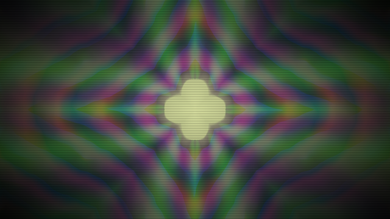

# Zygote

A real-time visual signal chain for live shows: a node graph of GPU passes,
driven by a cue timeline. Projects depend on Zygote as a library and add their
own nodes in Rust or WGSL.

```
┌────────────────────┐   UDP / JSON (node.param = value)   ┌───────────────────────────┐
│  zygote-timeline   │ ───────────────────────────────────▶ │  your project binary      │
│  gpui-kit host UI  │ ◀─ ─ ─ ─ ─ ─ ─ ─ ─ ─ ─ ─ ─ ─ ─ ─ ─ ─ │  = zygote-render library  │
│  cues · transport  │   structure + params (on connect)    │  + your nodes + your graph│
└────────────────────┘                                      └───────────────────────────┘
            └──────────────── zygote-core (node defs, typed params, graph, timeline, protocol) ─┘
```

| crate | what |
| --- | --- |
| `crates/zygote-core` | Graphics-free data model: node definitions, typed parameters, graphs, modulators, cue timeline, wire protocol. Pure functions, fully unit tested. |
| `crates/zygote-macros` | `#[derive(NodeParams)]`: a Rust struct is a node's whole parameter declaration. |
| `crates/zygote-render` | The engine as a library (nannou 0.20 / Bevy 0.19) plus the stock `zygote` binary. One generic shader-node material; node code never touches Bevy. |
| `crates/zygote-timeline` | gpui-kit window: graph view, transport, cue axis, typed controls per parameter. Knows nothing about shaders. |
| `projects/demo` | A project consuming the engine: one Rust-declared node, one WGSL-file node, its own graph and assets. |
| `projects/haze` | Proof-of-concept show: monochrome pulsing geometry and noise haze from a central point, three WGSL nodes. |

| `projects/haze` | `projects/demo` (kaleido + scanlines are project nodes) | timeline UI |
| --- | --- | --- |
|  |  |  |

## Running

```sh
cargo run --release -p zygote-haze        # monochrome proof of concept
cargo run --release -p zygote-demo        # a project: image → warp → kaleido → feedback → scanlines
cargo run --release -p zygote-timeline    # the UI; connects to udp://127.0.0.1:9471
cargo run --release -p zygote -- --showcase   # stock renderer, builtin nodes only
```

The UI asks the renderer for its graph structure and parameter list, draws
the graph, and builds one control per parameter: sliders for floats and
vec2/color components, a switch for bools, a button row for choices. Press
**Play** to loop the demo cues. Moving a control takes manual control of that
parameter until released; manual always beats the cues. If the renderer is
restarted the UI notices, re-describes, and re-pushes its state.

Renderer options: `[graph.json] [--port N] [--size WxH] [--assets DIR]
[--nodes DIR] [--showcase] [--capture out.png [--frames N] [--every K]]`
(`--every` saves a numbered frame sequence). Keys: `S` screenshot, `Esc` quit.

## What a node is

A node is one fullscreen pass with named texture inputs, an optional feedback
tap and typed parameters. That is the whole vocabulary; render targets,
cameras, wiring, feedback ping-pong, uniform layout, UI controls and cue
interpolation are all derived from the declaration. Two ways to write one:

**A WGSL file** with a `//!` header, loaded from a project's `assets/nodes/`
and hot-reloaded on save:

```wgsl
//! node: scanlines
//! doc: CRT-style scanlines
//! input source
//! param density: float = 180 in 20..600 "Lines across the frame"
//! param tint: color = #b8ffd0 "Phosphor tint"

@fragment
fn fragment(in: VertexOutput) -> @location(0) vec4<f32> {
    let c = source(in.uv).rgb;                       // inputs are functions
    let line = 0.5 + 0.5 * sin(in.uv.y * params.density * 3.14159);
    return vec4<f32>(c * line * params.tint.rgb, 1.0);   // params.<name>, frame.time, frame.aspect
}
```

**A Rust type**, when you want typed access or to ship the node in a crate:

```rust
use zygote_render::prelude::*;

#[derive(NodeParams, Clone)]
struct Kaleido {
    /// Number of mirror wedges
    #[param(default = 6.0, min = 1.0, max = 24.0)]
    segments: f32,
    #[param(default = "screen", options = ["multiply", "screen", "add", "alpha"])]
    mode: String,
    #[param(default = "#ffffff")]
    tint: [f32; 4],
}

impl RustNode for Kaleido {
    const NAME: &'static str = "kaleido";
    const INPUTS: &'static [Input] = &[Input::required("source")];
    const SHADER: &'static str = include_str!("kaleido.wgsl");
    type Params = Self;
}

fn main() {
    ZygoteApp::new()
        .asset_root(env!("CARGO_MANIFEST_DIR"))
        .register::<Kaleido>()
        .node_dir("nodes")
        .graph_file("graphs/main.json")
        .parse_args()
        .run();
}
```

Parameter types: `float` (min..max), `bool`, `choice` (named options),
`color` (`#rrggbb`), `vec2`. Floats, vec2 and colors interpolate between
cues; bools and choices hold until the target cue's time. Generated WGSL
gives every node `params.<name>`, `<input>(uv)`, `has_<input>()`,
`previous(uv)` for feedback nodes, and `frame.{time, dt, aspect, index}`.
Param and input names must not collide with imported WGSL items; the header
parser rejects that.

Builtin nodes (`crates/zygote-core/nodes/`): `solid`, `test_pattern`,
`noise`, `warp`, `blend`, `feedback`, `color_grade`. Structural kinds the
renderer implements itself: `image` (PNG/JPEG asset) and `camera`
(placeholder; no capture backend yet).

If an effect cannot be expressed as one pass with these declarations, the
answer is to grow this vocabulary in Zygote (a compute pass, an intermediate
target), not to hand a node Bevy's `World`. Most project nodes needing raw
Rust would mean the vocabulary is wrong.

## Graph files

Wiring and initial values only; node kinds come from the library:

```json
{
  "name": "demo",
  "nodes": [
    { "id": "image",   "type": "image", "path": "images/sample.png" },
    { "id": "warp",    "type": "warp", "inputs": ["image"], "params": { "amount": 0.06 } },
    { "id": "kaleido", "type": "kaleido", "inputs": ["warp"], "params": { "segments": 8, "tint": "#ffe0c0" } },
    { "id": "trails",  "type": "feedback", "inputs": ["kaleido"], "params": { "decay": 0.88 } }
  ],
  "output": "trails",
  "modulations": [ { "target": "warp.amount", "source": "lfo", "rate_hz": 0.1, "phase": 0, "shape": "sine", "depth": 0.05 } ]
}
```

Modulators: `time`, `lfo` (sine/triangle/saw/square), `audio_band {band}` and
`audio_level` (an 8-band `AudioBands` hook nothing fills yet).

## Architecture notes

- **Render passes.** `nodes::build_runtime` walks the graph in topological
  order; each shader node gets an offscreen `Camera3d` on its own render
  layer, a fullscreen quad with the single `NodeMaterial`, and an
  `Rgba16Float` target (two for feedback, swapped every frame). The pipeline
  key carries the node's generated shader, so one material type renders every
  node kind. The window shows the output on a quad in a perspective 3D scene.
- **Resolution order** (`zygote_core::resolve_params`): graph base value →
  cue → manual override, plus float modulators, conformed to the type.
- **Protocol v2.** JSON per UDP datagram, version field in every renderer
  message: `hello`, `structure` (UI-facing graph summary), `describe`
  (typed parameter descriptors), `set_param(s)`, `clear_param`, `clear_all`,
  `transport`, `ping`/`pong`.
- **Projects** are workspace members depending on `zygote-render` by path.
  Version pinning and a project template are deferred until a project needs
  to stop moving with the engine.

## Versions and building

nannou `0.20.0` is the first Bevy-based nannou and pins Bevy `0.19`; gpui-kit
`0.6.0` builds on `gpui-pre 0.3.x`. Both are pinned with `=`. Bevy 0.19
needs rustc ≥ 1.95; `rust-toolchain.toml` pins channel 1.98.

Linux build deps (Debian/Ubuntu): `libxkbcommon-dev libxkbcommon-x11-dev
libwayland-dev libasound2-dev libudev-dev libzstd-dev pkg-config`.

Headless smoke test (Xvfb + Mesa lavapipe):

```sh
xvfb-run -a -s "-screen 0 1280x720x24" env WGPU_BACKEND=vulkan \
  target/debug/zygote-demo --capture out.png --frames 90
```

## Not in this pass

- Live camera capture backend (kind and hook exist).
- Real audio analysis (modulator and hook exist).
- Runtime graph editing from the UI; graphs are files the agent edits.
- Compute passes and multi-pass nodes; the vocabulary grows when an effect needs them.
