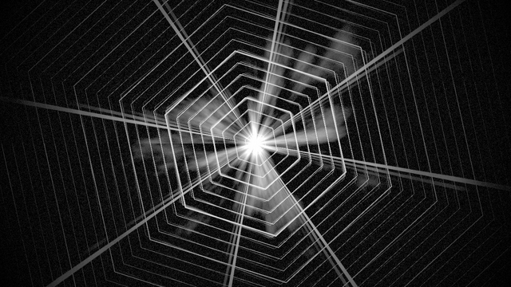
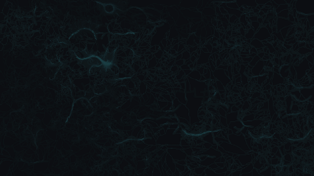
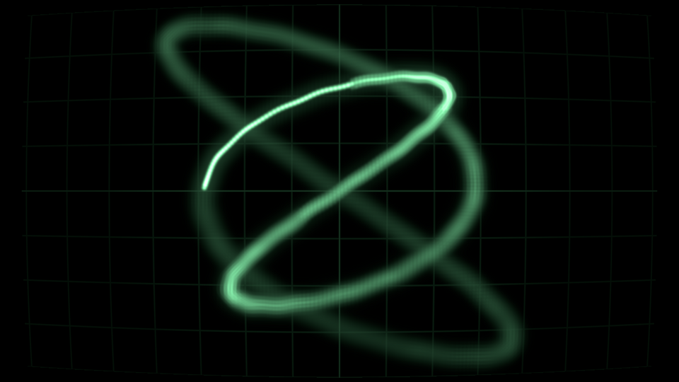
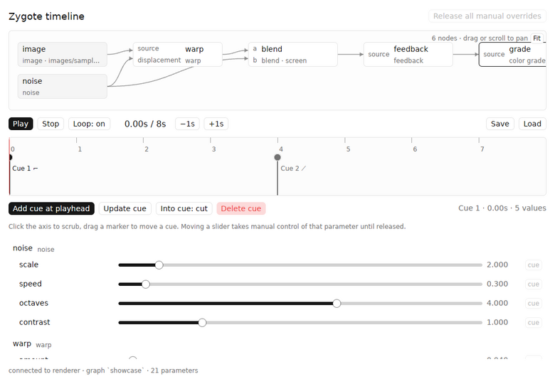
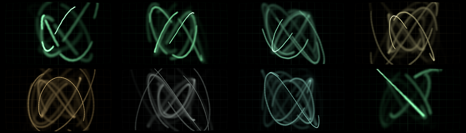
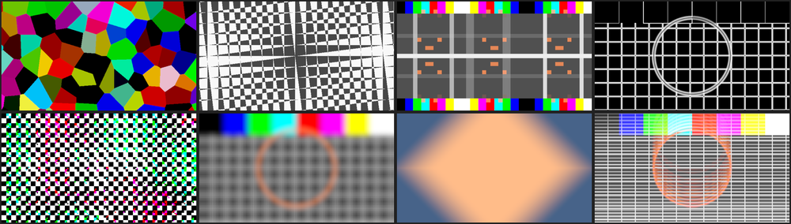

# Zygote

A real-time visual signal chain for live shows: a node graph of GPU passes,
driven by a cue timeline. Projects depend on Zygote as a library and add their
own nodes in Rust or WGSL.

```
┌────────────────────┐   UDP / JSON (node.param = value)   ┌───────────────────────────┐
│  zygote-timeline   │ ───────────────────────────────────▶ │  your project binary      │
│  gpui-kit host UI  │ ◀─ ─ ─ ─ ─ ─ ─ ─ ─ ─ ─ ─ ─ ─ ─ ─ ─ ─ │  = zygote-render library  │
│  cues · transport  │   structure + params (on connect)    │  + your nodes + your graph│
└────────────────────┘                                      └───────────────────────────┘
            └──────────────── zygote-core (node defs, typed params, graph, timeline, protocol) ─┘
```

| crate | what |
| --- | --- |
| `crates/zygote-core` | Graphics-free data model: node definitions, typed parameters, graphs, modulators, cue timeline, wire protocol. Pure functions, fully unit tested. |
| `crates/zygote-macros` | `#[derive(NodeParams)]`: a Rust struct is a node's whole parameter declaration. |
| `crates/zygote-render` | The engine as a library (nannou 0.20 / Bevy 0.19) plus the stock `zygote` binary. One generic shader-node material; node code never touches Bevy. |
| `crates/zygote-timeline` | gpui-kit window: graph view, transport, cue axis, typed controls per parameter. Knows nothing about shaders. One state store (`app/mod.rs`), logic modules beside it, one file per component under `app/views/`. |
| `projects/demo` | A project consuming the engine: one Rust-declared node (`rgb_shift`), one WGSL-file node (`scanlines`), its own graph and assets. |
| `projects/haze` | Proof-of-concept show: monochrome pulsing geometry and noise haze from a central point, three WGSL nodes. |
| `projects/mycelium` | A CPU simulation source (tip-growth network traced by nutrient agents) with LFOs and an envelope on its parameters. |
| `projects/scope` | An analog XY oscilloscope: the beam traces Lissajous knots onto slow phosphor (feedback), a show file steps through harmonic ratios with ramps and turns the figure with an LFO. Three WGSL nodes. |

| `projects/haze` | `projects/mycelium` | `projects/scope` |
| --- | --- | --- |
|  |  |  |

| timeline UI: graph as node filter, modulation rack, cues | `projects/scope` through its cues |
| --- | --- |
|  |  |

## Running

```sh
cargo run --release -p zygote-haze        # monochrome proof of concept
cargo run --release -p zygote-mycelium    # CPU simulation source with LFOs
cargo run --release -p zygote-timeline -- projects/mycelium/mycelium.show.json
cargo run --release -p zygote-scope       # XY oscilloscope; pair with projects/scope/scope.show.json
cargo run --release -p zygote-demo        # a project: image → warp → kaleido → feedback → rgb_shift → scanlines
cargo run --release -p zygote-timeline    # the UI; connects to udp://127.0.0.1:9471
cargo run --release -p zygote -- --showcase   # stock renderer, builtin nodes only
```

The UI asks the renderer for its graph structure and parameter list, draws
the graph (click a node to focus its parameters, click empty canvas to show
all), and builds one control per parameter: sliders for floats and ints,
per-component sliders for vec2 and color, a switch for bools, a button row
for choices. Image sources show their file as a thumbnail in the graph and a
preview in the parameter list; the renderer only sends the file's path, the
UI reads it from disk. Hover any button for what it does and its key; the
`ⓘ` button in the header lists every key and gesture.

**Transport owns time.** While the UI is connected the renderer's clock
follows the playhead: pause freezes the picture, stop returns to zero,
scrubbing scrubs the animation. Feedback trails freeze too. Start the
renderer with `--free-run` to keep it on the wall clock (installations with
no UI attached free-run automatically).

**Cues.** Stopped and parked on a cue, every control edits that cue
directly; the mode chip says `editing cue N`. While playing (or after
`Force live`), controls are live values layered over the cues until
released. `⏎` adds a cue at the playhead that absorbs the current live
values; `[` and `]` park on the previous/next cue. The lane under the chips
shows how values travel between cues: a ramp interpolates, a flat line then a
jump cuts. Double-click any parameter row to reset it to its default.

**Keys** (handled at the window, no control can swallow them): `space`
play/pause, `esc` stop, `home` to zero, `[` `]` cues, `⏎` add cue, `e`
force live, `l` loop, `t` tile the output window next to the UI, `shift-t`
pop it back out.

**Modulation.** Shared sources live in the rail's rack: LFOs (shape, rate,
phase) and ADSR envelopes driven by a named trigger. Each float or int
parameter row has a `mod` chip: pick a source and a bipolar depth, and the
source's value times depth is *added* to the resolved value, so the slider
always means the centre and depth 0 is exactly the slider. A dark ghost mark
on the slider shows where the value actually is. Sources run on the
transport clock: pausing freezes them, scrubbing rewinds them, and the UI
and renderer evaluate the same definition so they agree. Envelopes are a
pure function of the gate log, so a key pressed while paused does nothing
until play. **Key learn:** press `Learn` on an envelope (or `Learn cue key`
on a cue), then a key; holding the key gates the envelope. Transport keys
are refused. Modulation and key bindings are saved in the show file next to
the cues.

Renderer options: `[graph.json] [--port N] [--size WxH] [--assets DIR]
[--nodes DIR] [--showcase] [--free-run] [--capture out.png [--frames N]
[--every K]]` (`--every` saves a numbered frame sequence).

**Output window navigation.** The output is a quad in a 3D scene, so you can
move around it: wheel dollies in and out, left-drag pans, right-drag (or
middle-drag) orbits, arrow keys pan, `+`/`-` dolly, `Home` or `0` resets to
the flat full-frame view. `S` saves a screenshot, `Esc` quits.

## What a node is

A node is one fullscreen pass with named texture inputs, an optional feedback
tap and typed parameters. That is the whole vocabulary; render targets,
cameras, wiring, feedback ping-pong, uniform layout, UI controls and cue
interpolation are all derived from the declaration. Two ways to write one:

**A WGSL file** with a `//!` header, loaded from a project's `assets/nodes/`
and hot-reloaded on save:

```wgsl
//! node: scanlines
//! doc: CRT-style scanlines
//! input source
//! param density: float = 180 in 20..600 "Lines across the frame"
//! param tint: color = #b8ffd0 "Phosphor tint"

@fragment
fn fragment(in: VertexOutput) -> @location(0) vec4<f32> {
    let c = source(in.uv).rgb;                       // inputs are functions
    let line = 0.5 + 0.5 * sin(in.uv.y * params.density * 3.14159);
    return vec4<f32>(c * line * params.tint.rgb, 1.0);   // params.<name>, frame.time, frame.aspect
}
```

**A Rust type**, when you want typed access or to ship the node in a crate
(the same declaration with a `RustSource` impl instead makes a CPU texture
source: Zygote calls `update(&params, &frame, &mut pixels)` every frame and
uploads the result, which is how `projects/mycelium` runs its simulation):

```rust
use zygote_render::prelude::*;

#[derive(NodeParams, Clone)]
struct RgbShift {
    /// Offset distance (fraction of frame height)
    #[param(default = 0.004, min = 0.0, max = 0.05)]
    amount: f32,
    #[param(default = "radial", options = ["fixed", "radial"])]
    mode: String,
    #[param(default = "#ffffff")]
    tint: [f32; 4],
}

impl RustNode for RgbShift {
    const NAME: &'static str = "rgb_shift";
    const INPUTS: &'static [Input] = &[Input::required("source")];
    const SHADER: &'static str = include_str!("rgb_shift.wgsl");
    type Params = Self;
}

fn main() {
    ZygoteApp::new()
        .asset_root(env!("CARGO_MANIFEST_DIR"))
        .register::<RgbShift>()
        .node_dir("nodes")
        .graph_file("graphs/main.json")
        .parse_args()
        .run();
}
```

Parameter types: `float` (min..max), `int` (min..max, stepped), `bool`,
`choice` (named options), `color` (`#rrggbb`), `vec2`. Floats, vec2 and
colors interpolate between cues, ints step through whole values, bools and
choices hold until the target cue's time. Generated WGSL
gives every node `params.<name>`, `<input>(uv)`, `has_<input>()`,
`previous(uv)` for feedback nodes, and `frame.{time, dt, aspect, index}`.
Param and input names must not collide with imported WGSL items; the header
parser rejects that.

Builtin nodes (`crates/zygote-core/nodes/`), by role:

| Role | Nodes |
| --- | --- |
| generators | `solid`, `test_pattern`, `noise` (fBm), `voronoi` (cells / edges / distance / bubbles), `checker` (scroll, rotate, moiré), `radial_gradient` (circle / square / diamond) |
| geometry | `warp` (procedural or a `displacement` input), `kaleido`, `mirror_tile`, `pixelate` |
| compositing | `blend` (multiply / screen / add / alpha), `luma_mask` (b over a through a mask input or b's own brightness) |
| time | `feedback` (zoom / rotate / hue spiral trails), `streak` (directional trails) |
| analysis and finishing | `edge_detect`, `blur` (one axis or both; threshold for bloom), `dither`, `vignette`, `color_grade` |

Colours are RGBA. The fourth slider is alpha; generators emit it (`solid`,
`radial_gradient`, `checker`), filters keep their source's alpha, `blend`
and `luma_mask` composite it, and `feedback`/`streak` let it decay with the
trail. The output window ignores alpha (the quad is opaque), so it only
matters inside the graph: `blend` in `alpha` mode and `luma_mask` on the
`alpha` channel.

Bloom is a graph, not a node: `blur` with a threshold, then `blend` in
`add` mode over the source. `examples/graphs/palette.json` chains most of
the set. Structural kinds the renderer implements itself: `image`
(PNG/JPEG asset) and `camera` (placeholder; no capture backend yet).



If an effect cannot be expressed as one pass with these declarations, the
answer is to grow this vocabulary in Zygote (a compute pass, an intermediate
target), not to hand a node Bevy's `World`. Most project nodes needing raw
Rust would mean the vocabulary is wrong.

## Graph files

Wiring and initial values only; node kinds come from the library:

```json
{
  "name": "demo",
  "nodes": [
    { "id": "image",   "type": "image", "path": "images/sample.png" },
    { "id": "warp",    "type": "warp", "inputs": ["image"], "params": { "amount": 0.06 } },
    { "id": "kaleido", "type": "kaleido", "inputs": ["warp"], "params": { "segments": 8, "tint": "#ffe0c0" } },
    { "id": "trails",  "type": "feedback", "inputs": ["kaleido"], "params": { "decay": 0.88 } }
  ],
  "output": "trails",
  "modulations": [ { "target": "warp.amount", "source": "lfo", "rate_hz": 0.1, "phase": 0, "shape": "sine", "depth": 0.05 } ]
}
```

Modulators: `time`, `lfo` (sine/triangle/saw/square), `audio_band {band}` and
`audio_level` (an 8-band `AudioBands` hook nothing fills yet).

## Architecture notes

- **Render passes.** `nodes::build_runtime` walks the graph in topological
  order; each shader node gets an offscreen `Camera3d` on its own render
  layer, a fullscreen quad with the single `NodeMaterial`, and an
  `Rgba16Float` target (two for feedback, swapped every frame). The pipeline
  key carries the node's generated shader, so one material type renders every
  node kind. The window shows the output on a quad in a perspective 3D scene.
- **Resolution order** (`zygote_core::resolve_params`): graph base value →
  cue → manual override, plus modulation offsets on floats and ints,
  conformed to the type.
- **Protocol v2.** JSON per UDP datagram, version field in every renderer
  message: `hello`, `structure` (UI-facing graph summary), `describe`
  (typed parameter descriptors), `set_param(s)`, `clear_param`, `clear_all`,
  `transport` (drives the renderer's clock), `arrange` (places the output
  window), `modulation` (the show's sources and assignments), `gate`
  (trigger on/off at transport time), `ping`/`pong`.
- **Projects** are workspace members depending on `zygote-render` by path.
  Version pinning and a project template are deferred until a project needs
  to stop moving with the engine.

## Versions and building

nannou `0.20.0` is the first Bevy-based nannou and pins Bevy `0.19`; gpui-kit
`0.6.0` builds on `gpui-pre 0.3.x`. Both are pinned with `=`. Bevy 0.19
needs rustc ≥ 1.95; `rust-toolchain.toml` pins channel 1.98.

Linux build deps (Debian/Ubuntu): `libxkbcommon-dev libxkbcommon-x11-dev
libwayland-dev libasound2-dev libudev-dev libzstd-dev pkg-config`.

Smoke test, run before pushing (CI runs it too): builds every project,
renders one frame of each headless (Xvfb + Mesa lavapipe when there is no
display, the real GPU otherwise) and fails on logged errors or a black frame.
Frames land in `target/smoke/` for comparison against `docs/`.

```sh
scripts/smoke.sh              # all projects
scripts/smoke.sh haze         # one project
```

A missing or unreadable image asset logs an error and renders as a
magenta/black checker rather than a black output. The output window is
re-created if the OS removes it (monitor unplugged); the renderer never exits
on window loss.

## Not in this pass

- Live camera capture backend (kind and hook exist).
- Real audio analysis (modulator and hook exist).
- Runtime graph editing from the UI; graphs are files the agent edits.
- Compute passes and multi-pass nodes; the vocabulary grows when an effect needs them.
- In-UI preview of the output (the output window tiles next to the UI instead).
- Key learn for toggling bools or momentary values (cues and envelope triggers are bindable).
- Cue-able modulation depth and LFO rate.
- MIDI and audio-onset triggers.
